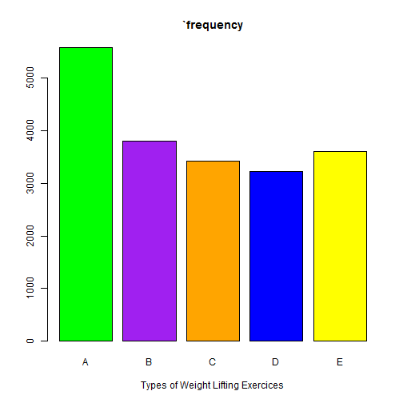

## Executive summary


Using devices such as Jawbone Up, Nike FuelBand, and Fitbit it is now possible to collect a large amount of data about personal activity relatively inexpensively. These type of devices are part of the quantified self movement – a group of enthusiasts who take measurements about themselves regularly to improve their health, to find patterns in their behavior, or because they are tech geeks. One thing that people regularly do is quantify how much of a particular activity they do, but they rarely quantify how well they do it. In this project, your goal will be to use data from accelerometers on the belt, forearm, arm, and dumbell of 6 participants. They were asked to perform barbell lifts correctly and incorrectly in 5 different ways. More information is available from the website here: http://groupware.les.inf.puc-rio.br/har (see the section on the Weight Lifting Exercise Dataset)."


## Data retrieval, processing and transformation

The data for this project come from this source: http://groupware.les.inf.puc-rio.br/har. The information has been generously provided for use use in this cousera course by the authors, Velloso, E.; Bulling, A.; Gellersen, H.; Ugulino, W.; Fuks, H. They have allowed the use of their paper “Qualitative Activity Recognition of Weight Lifting Exercises. Proceedings of 4th International Conference in Cooperation with SIGCHI (Augmented Human ’13) . Stuttgart, Germany: ACM SIGCHI, 2013.
The training data for this project are available here:
https://d396qusza40orc.cloudfront.net/predmachlearn/pml-training.csv
The test data are available here:
https://d396qusza40orc.cloudfront.net/predmachlearn/pml-testing.csv
Both were downloaded for use in this assignment on September 3, 2015 at 6:50am GMT + 8hours.


## Choosing the prediction algorithm

Steps Taken
1.Tidy data. Remove columns with little/no data.
2.Create Training and test data from traing data for cross validation checking
3.Trial 3 methods Random Forrest, Gradient boosted model and Linear discriminant analysis
4. Fine tune model through combinations of above methods, reduction of input variables or similar. The fine tuning will take into account accuracy first and speed of analysis second. 


## Loading the data


```r
training <- read.csv("pml-training.csv",na.strings=c("NA",""))
# sum(is.na(training))
```


```r
testing <-read.csv("pml-testing.csv",na.strings=c("NA",""))
```


## Processing the data

We first check for the total number of NAs in the dataset and then total NAs in each training and testing datasets


```r
sum(is.na(training))
```

```
## [1] 1921600
```


```r
na_train <- sapply(training, function(x) {sum(is.na(x))})
table(na_train)
```

```
## na_train
##     0 19216 
##    60   100
```

```r
na_test = sapply(testing, function(x) {sum(is.na(x))})
table(na_test)
```

```
## na_test
##   0  20 
##  60 100
```


Looking at the above values it is clear that 60 variables have 0 NA values while the rest have NA values for almost all the rows of the dataset, so we are going to ignore them using the following code.


```r
# for training dataset
columnNACounts <- colSums(is.na(training))        # getting NA counts for all columns
```


```r
badColumns <- columnNACounts >= 19000             # ignoring columns with majority NA values
```


```r
cleanTrainingdata <- training[!badColumns]        # getting clean data
```


```r
sum(is.na(cleanTrainingdata))                     # checking for NA values
```

```
## [1] 0
```


```r
cleanTrainingdata <- cleanTrainingdata[, c(7:60)] # removing unnecessary columns
```


```r
# for testing dataset
columnNACounts <- colSums(is.na(testing))         # getting NA counts for all columns
```


```r
badColumns <- columnNACounts >= 20                # ignoring columns with majority NA values
```


```r
cleanTestingdata <- testing[!badColumns]        # getting clean data
```


```r
sum(is.na(cleanTestingdata))                     # checking for NA values
```

```
## [1] 0
```


```r
cleanTestingdata <- cleanTestingdata[, c(7:60)] # removing unnecessary columns
```


Now the dataset don’t have any NA values. Therefore, data can be now used for some exploratory analysis and prediction model.


# Exploratory Data Analysis

We look at some summary statistics and frequency plot for the “classe” variable.


```r
summary(cleanTrainingdata$classe)
```

```
##    A    B    C    D    E 
## 5580 3797 3422 3216 3607
```


```r
plot(cleanTrainingdata$classe,col=c("green", "purple", "orange", "blue", "yellow"),main = "`frequency", xlab = "Types of Weight Lifting Exercices")
```

 


# Model Building

In this section, we will build a machine learning model for predicting the classe value based on the other features of the dataset.

## Data partitioning

We first partition the cleanTrainingdata dataset into training and testing data sets for building model


```r
library (caret)
```


```r
inTrain <- createDataPartition(y=cleanTrainingdata$classe, p=0.6, list=FALSE)
trainingdata <- cleanTrainingdata[inTrain,]
testingdata <- cleanTrainingdata[-inTrain,]
dim(trainingdata)
```

```
## [1] 11776    54
```


# Model building

Next, we use the features in the trainingdata dataset, we will build our model using the Random Forest machine learning technique.


```r
library(randomForest)
```

```
## Warning: package 'randomForest' was built under R version 3.1.1
```

```
## randomForest 4.6-10
## Type rfNews() to see new features/changes/bug fixes.
```

```r
model <- train(trainingdata$classe ~., data = trainingdata, method = "rf", prox = TRUE, trControl=trainControl(method = "cv",numbe = 4,allowParallel=TRUE))
print (model)
```

```
## Random Forest 
## 
## 11776 samples
##    53 predictor
##     5 classes: 'A', 'B', 'C', 'D', 'E' 
## 
## No pre-processing
## Resampling: Cross-Validated (4 fold) 
## 
## Summary of sample sizes: 8832, 8832, 8830, 8834 
## 
## Resampling results across tuning parameters:
## 
##   mtry  Accuracy  Kappa  Accuracy SD  Kappa SD
##    2    1         1      0.001        0.002   
##   27    1         1      0.004        0.005   
##   53    1         1      0.002        0.002   
## 
## Accuracy was used to select the optimal model using  the largest value.
## The final value used for the model was mtry = 27.
```

We build the model using 4-fold cross validation.

## In sample accuracy


Now we calculate the "in sample"" accuracy which is the prediction accuracy of our model on the training data set.


```r
training_pred <- predict(model, trainingdata)
confusionMatrix(training_pred, trainingdata$classe)
```

```
## Confusion Matrix and Statistics
## 
##           Reference
## Prediction    A    B    C    D    E
##          A 3348    0    0    0    0
##          B    0 2279    0    0    0
##          C    0    0 2054    0    0
##          D    0    0    0 1930    0
##          E    0    0    0    0 2165
## 
## Overall Statistics
##                                 
##                Accuracy : 1     
##                  95% CI : (1, 1)
##     No Information Rate : 0.284 
##     P-Value [Acc > NIR] : <2e-16
##                                 
##                   Kappa : 1     
##  Mcnemar's Test P-Value : NA    
## 
## Statistics by Class:
## 
##                      Class: A Class: B Class: C Class: D Class: E
## Sensitivity             1.000    1.000    1.000    1.000    1.000
## Specificity             1.000    1.000    1.000    1.000    1.000
## Pos Pred Value          1.000    1.000    1.000    1.000    1.000
## Neg Pred Value          1.000    1.000    1.000    1.000    1.000
## Prevalence              0.284    0.194    0.174    0.164    0.184
## Detection Rate          0.284    0.194    0.174    0.164    0.184
## Detection Prevalence    0.284    0.194    0.174    0.164    0.184
## Balanced Accuracy       1.000    1.000    1.000    1.000    1.000
```

Thus, from the above statistics we see that the in sample accuracy value is 1 which is 100%.


## Out of sample accuracy

We also calculate the "out of sample" accuracy which is the prediction accuracy of our model on the testing data set.


```r
testing_pred <- predict(model, testingdata)
confusionMatrix(testing_pred, testingdata$classe)
```

```
## Confusion Matrix and Statistics
## 
##           Reference
## Prediction    A    B    C    D    E
##          A 2231    9    0    0    0
##          B    0 1505    2    0    0
##          C    0    3 1366    9    0
##          D    0    1    0 1276    0
##          E    1    0    0    1 1442
## 
## Overall Statistics
##                                         
##                Accuracy : 0.997         
##                  95% CI : (0.995, 0.998)
##     No Information Rate : 0.284         
##     P-Value [Acc > NIR] : <2e-16        
##                                         
##                   Kappa : 0.996         
##  Mcnemar's Test P-Value : NA            
## 
## Statistics by Class:
## 
##                      Class: A Class: B Class: C Class: D Class: E
## Sensitivity             1.000    0.991    0.999    0.992    1.000
## Specificity             0.998    1.000    0.998    1.000    1.000
## Pos Pred Value          0.996    0.999    0.991    0.999    0.999
## Neg Pred Value          1.000    0.998    1.000    0.998    1.000
## Prevalence              0.284    0.193    0.174    0.164    0.184
## Detection Rate          0.284    0.192    0.174    0.163    0.184
## Detection Prevalence    0.285    0.192    0.176    0.163    0.184
## Balanced Accuracy       0.999    0.996    0.998    0.996    1.000
```

Thus, from the above statistics we see that the out of sample accuracy value is 0.996 which is 99.6%.


# Prediction Assignment

In this section, we apply the above machine learning algorithm to each of the 20 test cases in the testing data set provided.


```r
results <- predict(model, cleanTestingdata)
results <- as.character(results)
results
```

```
##  [1] "B" "A" "B" "A" "A" "E" "D" "B" "A" "A" "B" "C" "B" "A" "E" "E" "A"
## [18] "B" "B" "B"
```

